# Lab10Web

## Nama: Bagus aditya hermawan
## Nim: 312410382
## Kelas: TI.24.A.3
## Mata Kuliah: Pemrograman Web 1

## Untuk Praktikum 13 dan 14 ada dipaling bawah

## Langkah-langkah Praktikum

Membuat file dengan nama mobil.php.
###### 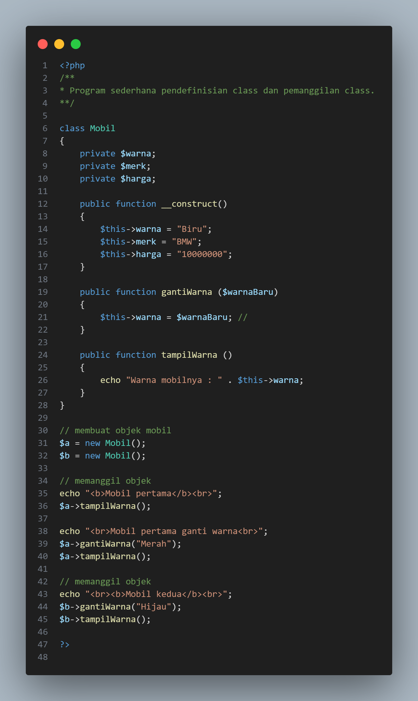

Class Library
Buat file baru dengan nama form.php
###### 

Buat file baru dengan nama form_input.ph.
###### 

Buat file dengan nama database.php.
###### 

Hasil
###### 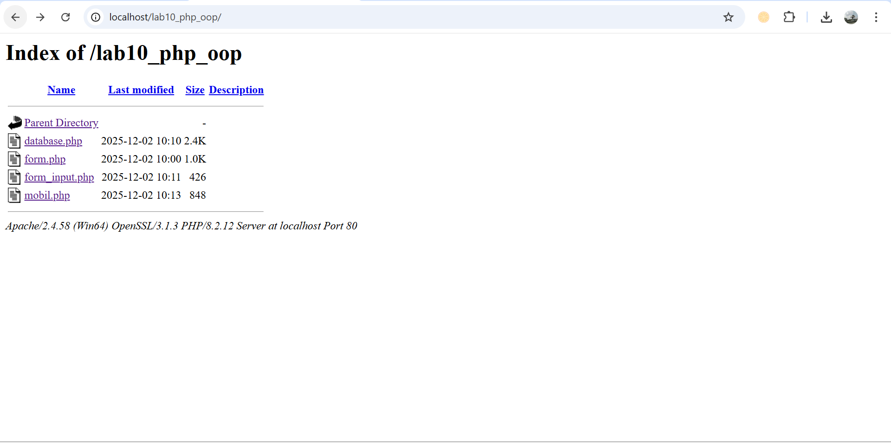

mobil.php
###### 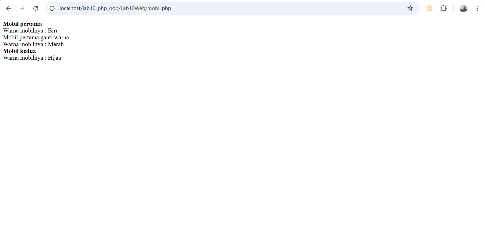

form_input.php
###### 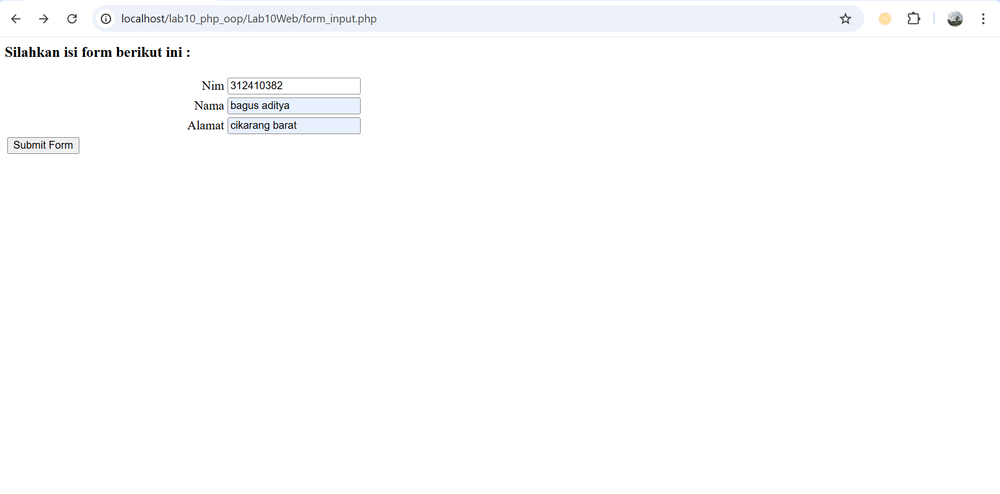

form.php
###### 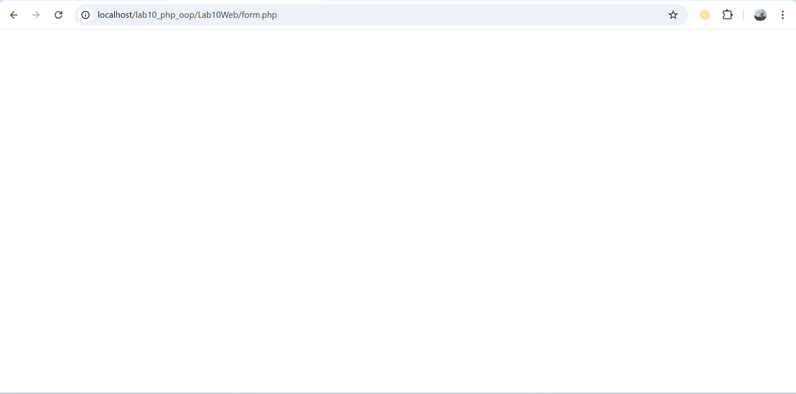

database.php
###### 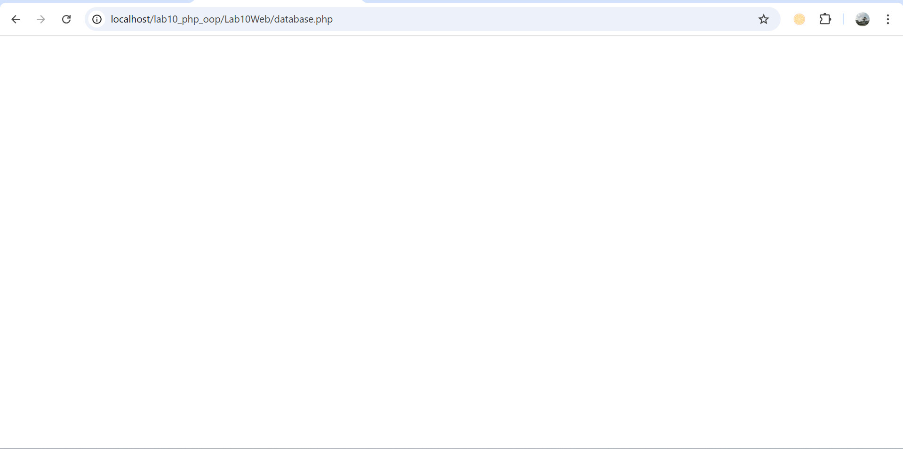

### Pertanyaan dan Tugas
Implementasikan konsep modularisasi pada kode program pada praktukum sebelumnya
dengan menggunakan class library untuk form dan database connection.

Setelah dicoba terdapat beberapa perubahan dalam file.
### index.php
File index.php berfungsi sebagai pusat kontrol dari seluruh alur program. Dengan penerapan konsep modularisasi dan penggunaan class library, file ini tidak lagi menangani logika yang kompleks seperti koneksi database atau pembuatan form secara langsung. fokus hanya pada proses routing, yaitu membaca parameter page dari URL kemudian memuat file module yang sesuai.
###### 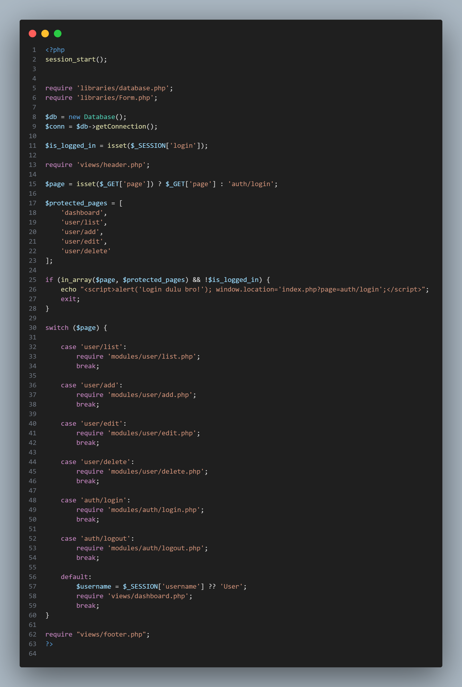

### libraries/form.php
File ini berfungsi sebagai class yang menangani pembuatan elemen form dengan otomatis dan membuat struktur lebih lengkap dan dinamis. membuat proses pembuatan form menjadi lebih praktis, konsisten, dan mudah dirawat.
###### 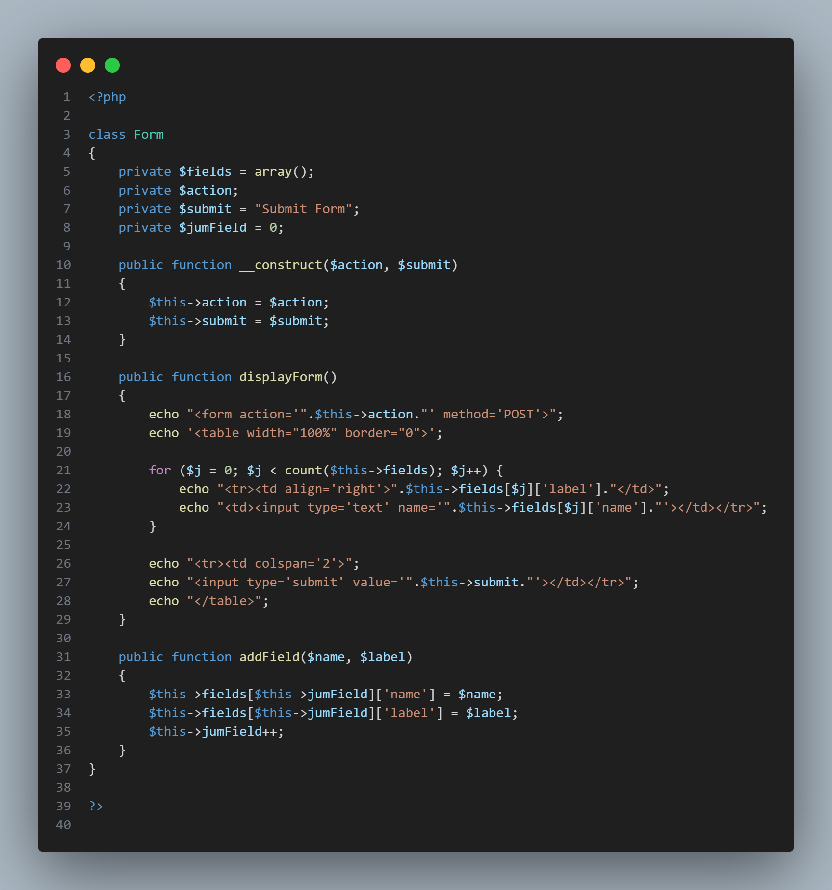

### libraries/database.php
File ini berfungsi sebagai class yang menangani seluruh proses koneksi ke database secara terpusat. Dengan memindahkan logika koneksi ke dalam sebuah class, maka program akan menjadi lebih modular dan mudah dikelola.
###### 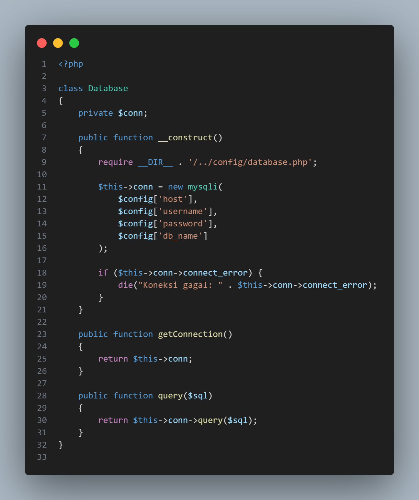

### config/database.php
file ini berfungsi untuk menyimpan pengaturan dasar yang dibutuhkan aplikasi untuk terkoneksi ke database. Dengan menaruh semua informasi penting seperti host, username, password, dan nama database dalam satu array bernama $config, proses pengelolaan aplikasi menjadi lebih sederhana.
###### 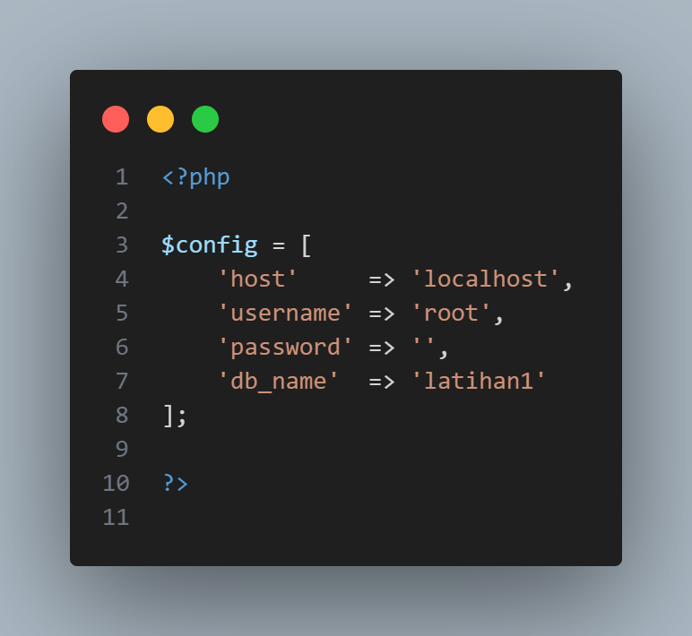

### Praktikum 13 dan 14
Membuat pencarian data dengan penggunaan filter pada query data. 
Input:
###### 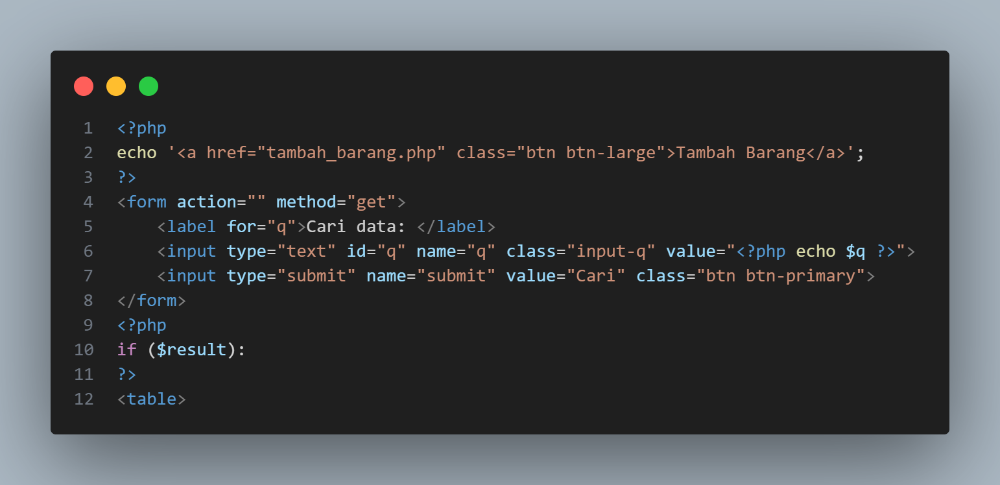

Lalu menambahkan filter pada query.
Input:
###### 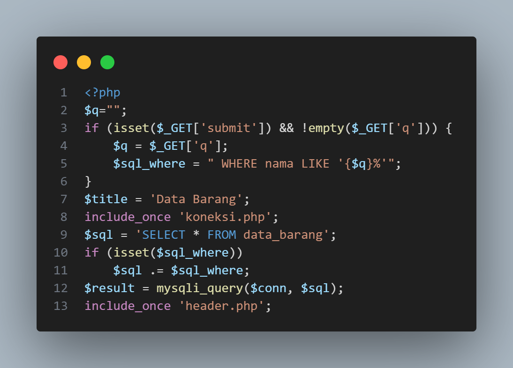

Output:
###### 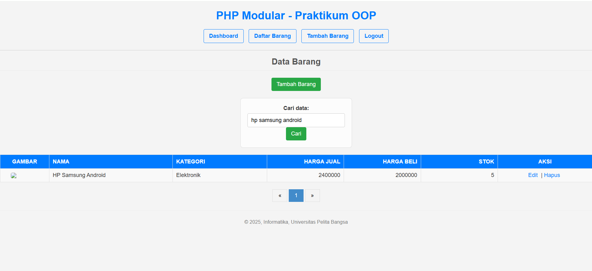

Berfungsi untuk mencari data barang di halaman awal dan berikutnya.

Membuat pagination yang dapat di geser kehalaman sebelumnya dan berikutnya dengan kode seperti dibawah:
Input:
###### 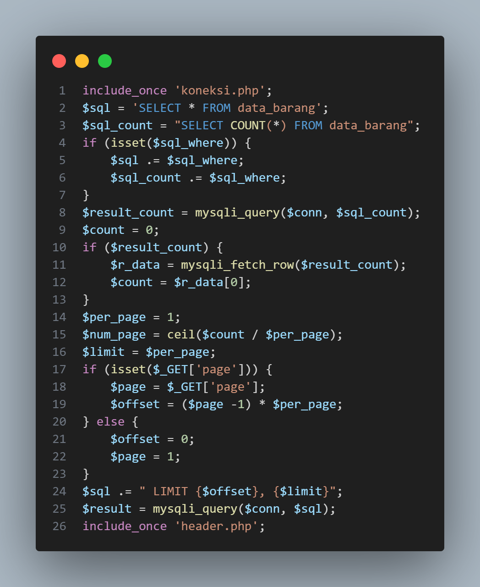
###### 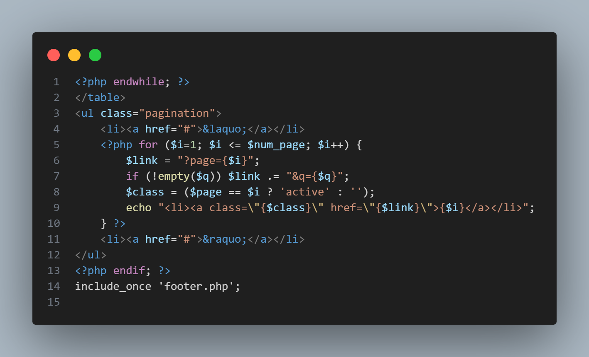

Output:
###### 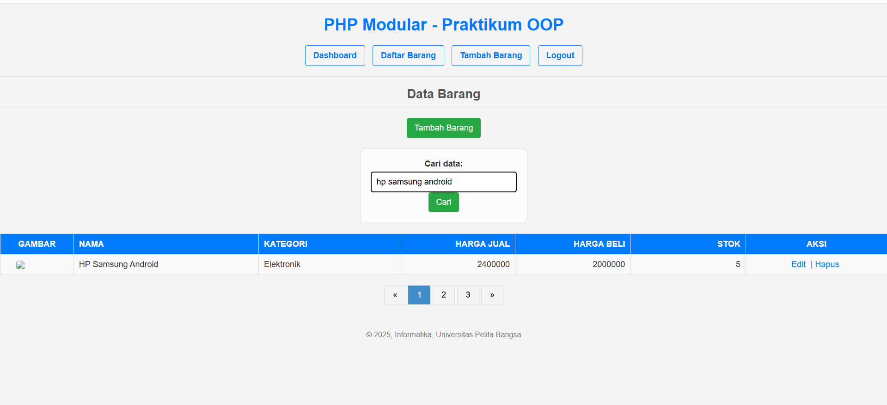